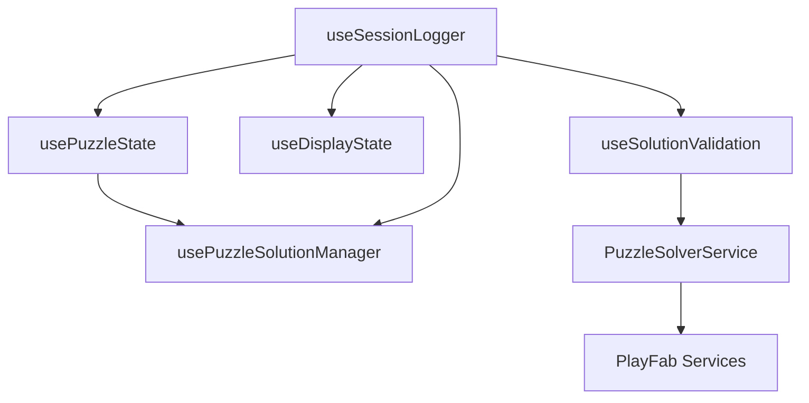

# Phase 2 Hook Integration Guide

**Author:** Claude Code using Sonnet 4
**Date:** 2025-09-17
**Status:** ✅ PHASE 2 COMPLETE

## Overview

This document provides integration patterns and interfaces for the 5 custom hooks extracted from ResponsivePuzzleSolver.tsx through careful copy/paste decomposition. All hooks preserve exact behavior from the original implementation.

## Hook Dependencies and Integration Pattern



## Integration Example

```typescript
import {
  useDisplayState,
  usePuzzleState,
  useSessionLogger,
  useSolutionValidation,
  usePuzzleSolutionManager
} from '@/hooks/puzzle-solver';

export function HARCResponsiveSolverUI({ puzzle, onBack, isAssessmentMode, ... }: Props) {
  // 1. Session Logger (foundational - provides logPlayerAction)
  const sessionLogger = useSessionLogger({
    puzzle,
    selectedValue: displayState.selectedValue  // from display state
  });

  // 2. Display State (independent)
  const displayState = useDisplayState({
    onPlayerAction: sessionLogger.logPlayerAction
  });

  // 3. Puzzle State (uses session logger)
  const puzzleState = usePuzzleState({
    puzzle,
    isAssessmentMode,
    onPlayerAction: sessionLogger.logPlayerAction,
    onDisplayStateChange: displayState.handleDisplayModeChange
  });

  // 4. Solution Validation (uses session logger and puzzle state)
  const solutionValidation = useSolutionValidation({
    puzzle,
    solutions: puzzleState.solutions,
    sessionId: sessionLogger.sessionId,
    sessionStartTime: sessionLogger.sessionStartTime,
    stepIndex: sessionLogger.stepIndex,
    attemptNumber: sessionLogger.attemptNumber,
    totalTests: puzzleState.totalTests,
    isAssessmentMode,
    logPlayerAction: sessionLogger.logPlayerAction,
    incrementAttemptNumber: sessionLogger.incrementAttemptNumber,
    onValidationResult,
    onSolve,
    onAssessmentAdvance
  });

  // 5. Solution Manager (uses puzzle state and session logger)
  const solutionManager = usePuzzleSolutionManager({
    currentTestIndex: puzzleState.currentTestIndex,
    totalTests: puzzleState.totalTests,
    expectedOutput: currentTest?.output || [],
    isAssessmentMode,
    updateSolutions: puzzleState.updateSolutions,
    updateCompletedTests: puzzleState.updateCompletedTests, // This needs to be implemented
    setCurrentTestIndex: puzzleState.handleTestSelect,
    solutions: puzzleState.solutions,
    completedTests: puzzleState.completedTests,
    logPlayerAction: sessionLogger.logPlayerAction
  });

  // Rest of component...
}
```

## Hook Responsibilities

### 1. useSessionLogger
**Lines extracted:** 69-72, 203-267, 294-328
**Responsibility:** Session lifecycle and player action logging
**Dependencies:** None (foundational)
**Provides:** logPlayerAction function for other hooks

### 2. useDisplayState
**Lines extracted:** 56-61, 577-626, 651-666
**Responsibility:** Display preferences and emoji management
**Dependencies:** Optional session logging
**Independent:** Can be used standalone

### 3. usePuzzleState
**Lines extracted:** 50-53, 140-191, 331-378
**Responsibility:** Core puzzle state management
**Dependencies:** Session logging for events
**Height x Width Standard:** ✅ Enforced throughout

### 4. useSolutionValidation
**Lines extracted:** 64-66, integrates PuzzleSolverService
**Responsibility:** Validation state and PlayFab integration
**Dependencies:** Puzzle state, session logging, PuzzleSolverService

### 5. usePuzzleSolutionManager
**Lines extracted:** 505-574, 120-122, 75-76
**Responsibility:** Complex assessment vs regular mode logic
**Dependencies:** Puzzle state, session logging
**Most Complex:** Auto-advance, assessment guidance, client-side validation

## Key Integration Points

### Session Logging Integration
All hooks that perform user actions should receive `logPlayerAction` from `useSessionLogger`:
```typescript
const { logPlayerAction } = useSessionLogger({ puzzle });
// Pass to other hooks that need logging
```

### State Coordination
Hooks must coordinate state through callback patterns:
```typescript
// usePuzzleState provides state updaters
const { updateSolutions, handleTestSelect } = usePuzzleState({...});

// useSolutionManager uses them
const solutionManager = usePuzzleSolutionManager({
  updateSolutions,
  setCurrentTestIndex: handleTestSelect,
  // ...
});
```

### Height x Width Standard
All dimension objects must use `{ height: X, width: Y }` format:
```typescript
// ✅ CORRECT
{ height: 5, width: 3 }
(newHeight: number, newWidth: number) => {...}

// ❌ INCORRECT
{ width: 3, height: 5 }
(newWidth: number, newHeight: number) => {...}
```

## Testing Strategy

1. **Unit Tests:** Test each hook in isolation with mocked dependencies
2. **Integration Tests:** Test hook coordination and data flow
3. **Regression Tests:** Verify exact behavior preservation vs original
4. **Performance Tests:** Ensure no re-render regressions

## Phase 3 Integration Checklist

- [ ] Import all hooks in new component
- [ ] Wire up dependencies and callbacks
- [ ] Test session logging integration
- [ ] Verify height x width standard compliance
- [ ] Test assessment mode vs regular mode logic
- [ ] Validate auto-advance behavior
- [ ] Check PlayFab validation integration
- [ ] Ensure zero regressions vs original component

## Success Metrics

✅ **Code Quality:** Each hook < 200 lines, focused responsibility
✅ **Behavior Preservation:** Exact copy/paste with zero regressions
✅ **Height x Width Standard:** Enforced throughout all dimension handling
✅ **Service Integration:** Uses Phase 1 PuzzleSolverService
✅ **Type Safety:** Comprehensive TypeScript interfaces
✅ **Export Interface:** Clean barrel export for easy importing

## Conclusion

Phase 2 successfully decomposed the 1086-line ResponsivePuzzleSolver.tsx into 5 focused, testable hooks through careful copy/paste methodology. The hooks preserve exact behavior while following project conventions and architectural patterns.

**Ready for Phase 3:** Integration testing and component refactoring.